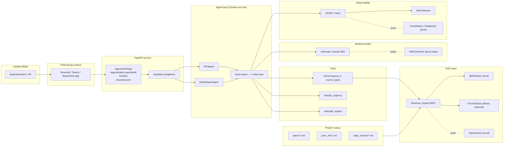

# Architecture

## Components

### Agent loop (`src/site_copilot/agents/base.py`)
Single n-step tool-use loop. Model proposes tool calls, we execute them, feed
results back. Two concrete agents (`RFIAgent`, `DailyReportAgent`) only
differ by system prompt and registered tools. Adding a third agent
(lookahead planning, materials tracking) means a new system prompt and
maybe one new tool — the loop is reused.

### RAG layer (`src/site_copilot/rag/`)
- `store.py` defines a `VectorStore` Protocol mirroring an OpenSearch
  document with metadata + lexical + optional dense vector field.
- `bm25_store.py` is the zero-friction default; `chroma_store.py` adds dense
  vectors when `SITE_COPILOT_RETRIEVER=hybrid`.
- `retriever.py` does hybrid fusion via **Reciprocal Rank Fusion** — the
  same algorithm OpenSearch's hybrid search uses, so the swap to production
  is parameter-tuning, not redesign.
- `ingest.py` chunks markdown specs by `##` heading (each MasterFormat
  section becomes one chunk) and treats RFIs and daily reports as whole-doc
  chunks (small + always-co-occurring content).

### Tools (`src/site_copilot/tools/registry.py`)
Three tools today. Each is a `ToolSpec` with description, JSONSchema input,
and a Python callable. `ToolRegistry` produces Anthropic-shaped tool
definitions and dispatches calls. Adding a tool is a one-function diff.

### Observability (`src/site_copilot/observability/`)
- `tracing.py` writes JSONL events keyed by `run_id` (one per agent
  invocation) with spans for LLM calls and tool calls.
- `drift.py` watches a rolling window of three signals and emits alerts on
  >3σ moves. Sketch — production uses Bedrock Evaluation or Databricks ML
  monitoring with proper baselines.

### LLM client (`src/site_copilot/llm.py`)
Thin Anthropic SDK wrapper with:
- A **mock mode** triggered by `SITE_COPILOT_USE_MOCK_LLM=1`, so CI and
  offline runs exercise the full agent loop without an API key.
- A `complete(...)` signature shaped after Bedrock Converse so swapping
  providers is a constructor change, not a refactor.
- Per-model pricing for cost estimates.

## Stack mapping vs Suffolk's named stack

| Demo component | Suffolk production component |
| --- | --- |
| `anthropic.Anthropic` client | `bedrock-runtime` invoke_model |
| `BM25Store` + `ChromaStore` | OpenSearch hybrid (BM25 + kNN) |
| `Retriever._rrf` | OpenSearch hybrid score fusion |
| `Tracer` (JSONL) | CloudWatch Logs → Databricks bronze |
| `infra/Dockerfile` | Same |
| `infra/terraform/` | Same |
| `evals/run_evals.py` | Bedrock Evaluation jobs |
| `data/corpus/specs/` | Spec PDFs in SharePoint / Procore documents library |
| `data/corpus/prior_rfis/` | Procore RFI export → S3 → Boomi → Databricks |
| `data/corpus/daily_reports/` | Procore Daily Logs → Databricks |
